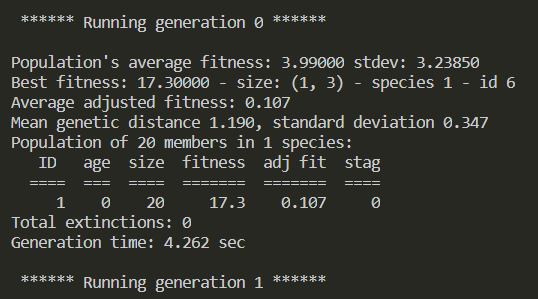
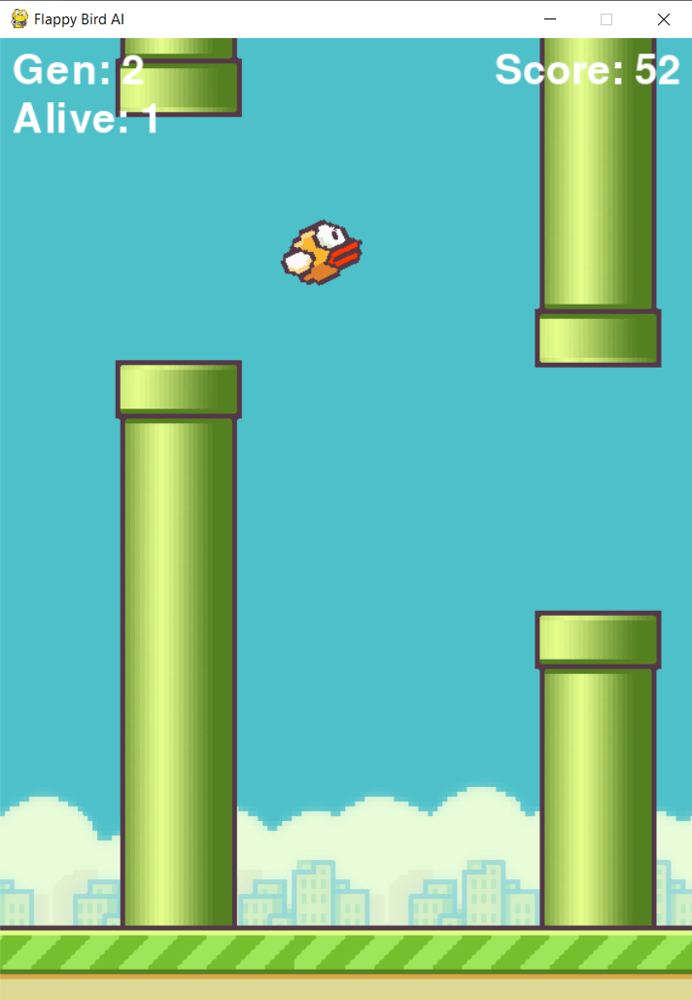

# FlappyBirdAI
A flappy bird AI using neat built in python 3.8.6 not tested on other versions.

# Overview
This project was built to explore the NEAT unsupervised neural networks learning library. Configuration of the neural network can be found in the confing-feed.txt file.
Please bear in mind this uses Tanh as its activation function, has 3 inputs of bird.y, top pipe, bottom pipe and does not use sigmoid. This means output is -1 to 1 and if above 0.5 the bird will flap.
# Output

## Note:
You will need pygame and Neat installed versions:
neat-python==0.92
pygame==2.0.1
